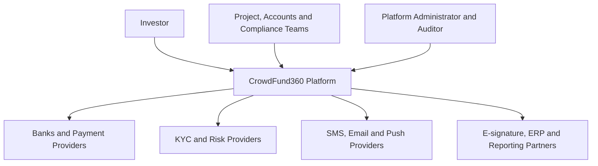
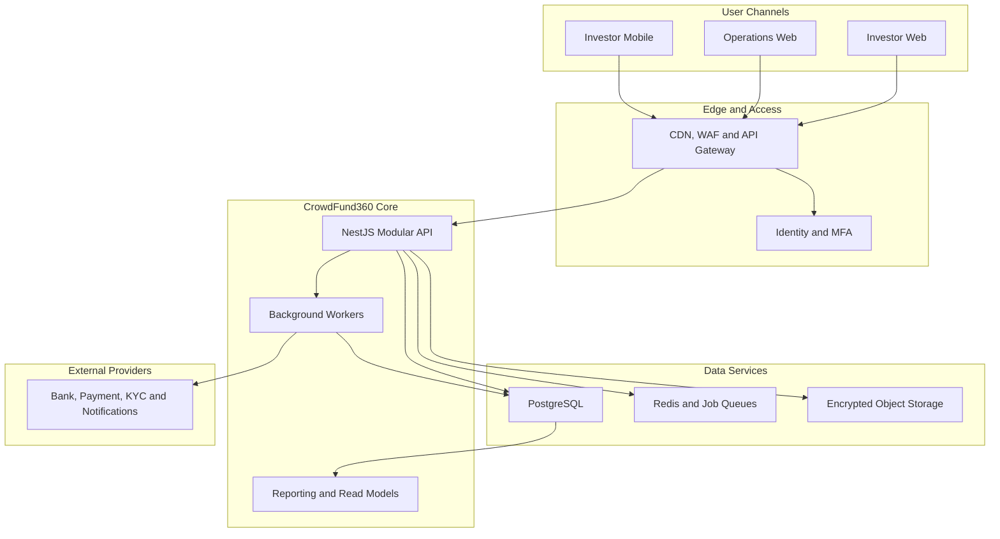
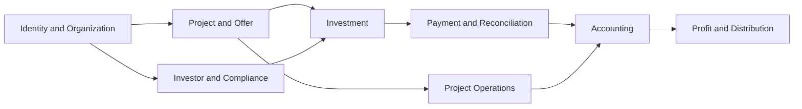
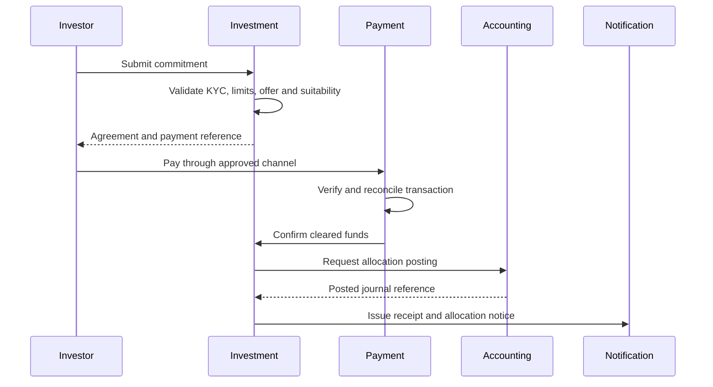
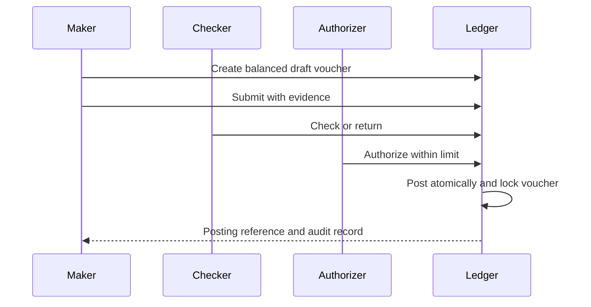
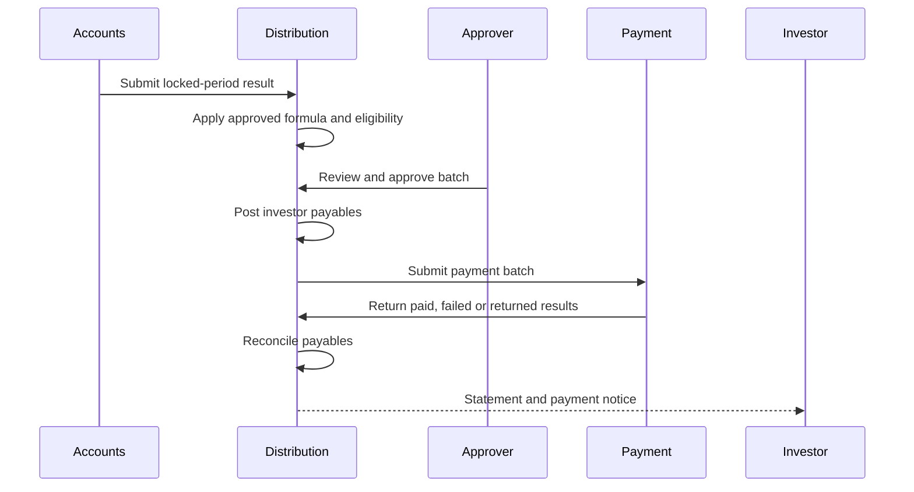
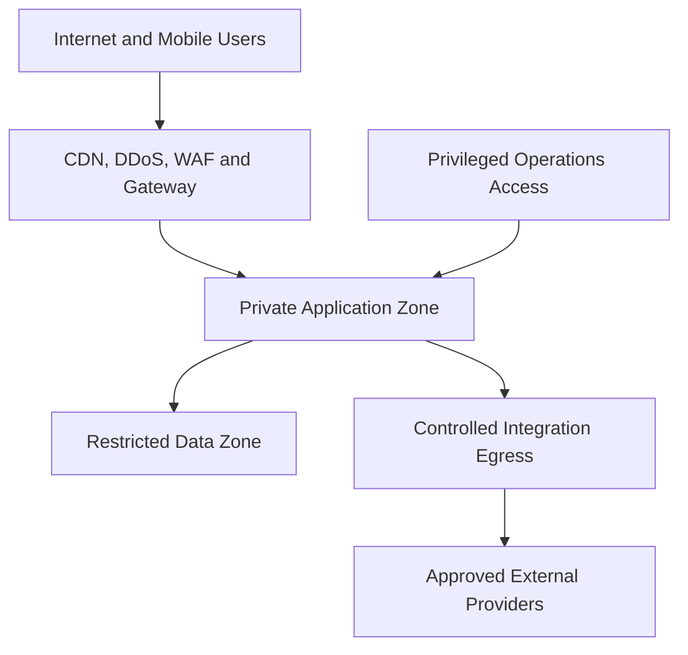
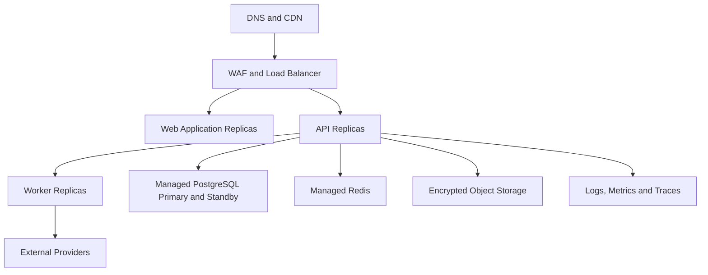

# CrowdFund360
## Solution Architecture Document

**Version:** 1.0  
**Status:** Proposed architecture baseline  
**Architecture style:** Domain-aligned modular monolith with event-driven integrations  
**Primary stack:** Next.js/React, React Native, NestJS/Node.js, PostgreSQL, Redis, S3-compatible storage  
**Audience:** Business owners, architects, engineers, security, finance, compliance, operations, auditors, and Agent AI development teams

---

## 1. Purpose

This document defines the target solution architecture for CrowdFund360, a multi-project crowdfunding and investment-administration platform. It translates the business model into application, data, integration, security, infrastructure, deployment, and operational architecture.

The design supports:

- Multiple organizations and projects
- Independent accounting and P&L for every project
- One investor investing in multiple projects
- Online and assisted offline investor onboarding
- KYC, AML, source-of-funds, risk, and compliance controls
- Project offers, investment commitments, payment reconciliation, and allocation
- Maker–checker–authorizer vouchers
- Budget, procurement, milestone-based fund release, profit distribution, and closure
- Live investor, project, accounting, compliance, and portfolio dashboards
- Complete auditability and controlled enterprise expansion

---

## 2. Architecture Drivers

### Business drivers

1. Trust through transparent project and investor accounting
2. Strict financial separation between projects
3. Support for online and offline investor operations
4. Fast launch with controlled development cost
5. Configurable business models and approval workflows
6. Bangladesh-first localization and future regional expansion
7. Enterprise and white-label readiness

### Quality drivers

- Security and privacy
- Financial integrity and auditability
- Availability and recoverability
- Performance and scalability
- Maintainability and modularity
- Regulatory adaptability
- Explainability of calculations and decisions

### Key constraints

- Financial calculations require fixed-precision arithmetic.
- Posted financial entries cannot be destructively modified.
- No user may create and finally approve the same controlled transaction.
- Public or regulated funding models remain disabled until approved.
- External payment/KYC providers may be unreliable or delayed.
- Mobile and offline-assisted channels must enforce central business rules.

---

## 3. Architecture Principles

1. **Financial integrity before convenience:** Every money movement must be idempotent, reconciled, posted, and auditable.
2. **Project isolation by design:** Organization and project scope are immutable parts of all relevant data.
3. **Explicit business commands:** Approve, post, reverse, release, refund, and distribute are explicit operations—not arbitrary status edits.
4. **Modular monolith first:** Start with one deployable backend but strong domain boundaries.
5. **API and event contracts:** Channels and integrations use stable, versioned contracts.
6. **Zero implicit trust:** Authenticate, authorize, validate scope, and audit every sensitive action.
7. **Human authority over AI:** AI advises and automates preparation; humans approve financial, compliance, legal, and production actions.
8. **Configuration over customer-specific forks:** Project types, workflows, limits, templates, and fees are configurable.
9. **Observability is a product feature:** Technical and business control metrics are designed from the beginning.
10. **Evolution by evidence:** Extract microservices only when scale, risk, ownership, or deployment independence justifies them.

---

## 4. System Context

### External actors and systems

| Actor/system | Interaction |
|---|---|
| Investor | Registration, KYC, project discovery, commitment, payment, portfolio, statements, complaints |
| Project team | Project plans, milestones, budgets, vouchers, evidence, updates |
| Accounts team | Voucher checks, postings, reconciliation, close, reporting, distribution |
| Compliance team | KYC/AML, risk, cases, holds, approvals |
| Administrator | Projects, assignments, policies, dashboards, platform configuration |
| Auditor | Read-only evidence, transactions, approvals, reports and audit logs |
| Bank/payment provider | Account validation, collections, callbacks, statements, refunds and distributions |
| KYC/risk provider | Identity/business verification, screening and risk results |
| Notification provider | SMS, email and push delivery |
| ERP/e-signature/reporting | Contract evidence, exports, accounting or analytical integration |

---

## 5. Container Architecture

### Container responsibilities

| Container | Responsibility |
|---|---|
| Investor Web | Public project discovery, onboarding, investment and portfolio experience |
| Operations Web | Project, accounts, compliance, administration, support and audit functions |
| Investor Mobile | Investor services, notifications, KYC capture and portfolio |
| API Gateway/WAF | TLS, routing, rate limits, bot/attack filtering, request controls |
| Identity/MFA | Authentication, tokens, MFA, sessions, device and recovery controls |
| NestJS API | Synchronous business rules and transactional operations |
| Workers | Notifications, callbacks, reconciliation, documents, reports, distribution jobs |
| PostgreSQL | Authoritative transactional, accounting and audit data |
| Redis | Cache, rate limits, distributed locks, queues and short-lived state |
| Object Storage | Versioned encrypted documents and media |
| Reporting | Read-optimized dashboards and scheduled reports |

---

## 6. Logical Domain Architecture

### 6.1 Identity and Organization

- Organization and tenant configuration
- User, role, permission, project assignment and approval limit
- MFA, session, device, delegation and access review
- Authentication/authorization audit

### 6.2 Investor and Compliance

- Investor, institutional investor, beneficial owner
- KYC case, identity documents, bank account, nominee
- Consent, suitability, source of funds, risk and screening
- Holds, suspicious cases, periodic reviews and expiry

### 6.3 Sponsor, Project, and Offer

- Sponsor, owners, management team and legal records
- Project, business plan, revenue plan, risk, budget and milestone
- Due-diligence checklist, findings and approvals
- Versioned project offer and published disclosures

### 6.4 Investment

- Project discovery and comparison
- Eligibility, suitability and limit validation
- Commitment, agreement, payment reservation and allocation
- Investment unit, investor-project position and lifecycle

### 6.5 Payment and Reconciliation

- Payment instruction/reference and provider transaction
- Callback/webhook inbox
- Bank statement ingestion
- Matching, reconciliation, exceptions and refunds
- Collection, release and distribution payment orchestration

### 6.6 Accounting and Finance

- Chart of accounts and fiscal periods
- Vouchers, journals, lines, approvals, posting and reversal
- Investor, vendor, bank, receivable, payable and asset sub-ledgers
- Project-level trial balance, P&L, balance sheet and cash flow
- Budget, commitment, actual and variance

### 6.7 Project Operations

- Procurement, expenses, vendors, assets and inventory
- Milestone progress, evidence, review and controlled fund release
- Project updates, deviations, corrective actions and closure

### 6.8 Profit and Distribution

- Period close and approved financial result
- Formula version, reserves, taxes, prior loss and distributable profit
- Distribution proposal, investor entitlement, payable and payment
- Failed/returned payments, reconciliation and statements

### 6.9 Shared Business Services

- Workflow, approval and task management
- Documents, agreements and templates
- Notifications and preferences
- Complaints, disputes and service cases
- Reports, dashboards and exports
- Audit events and configuration history

---

## 7. Module Dependency Rules

### Rules

- Identity is a foundational service and has no dependency on business modules.
- Investment references approved investors and published offer versions.
- Payment does not directly change investor balances; allocation and accounting services do so transactionally.
- Accounting owns posted financial truth.
- Dashboards consume read models and do not independently calculate authoritative balances.
- Documents and notifications respond to domain commands/events but do not own core business state.
- Modules may not query another module's tables directly from application code.

---

## 8. Critical Business Flows

### 8.1 Investment and allocation

### 8.2 Voucher posting

### 8.3 Profit distribution

---

## 9. Data Architecture

### 9.1 Primary data stores

| Store | Data | Consistency |
|---|---|---|
| PostgreSQL primary | Business transactions, workflows, accounting, audit | Strong transactional consistency |
| PostgreSQL read models | Dashboards, reporting projections | Eventual or scheduled consistency with freshness indicator |
| Redis | Cache, rate limits, jobs, short locks and temporary state | Non-authoritative |
| Object storage | Documents, media, generated statements | Versioned, encrypted, referenced from PostgreSQL |
| OpenSearch, later | Approved full-text search | Eventual consistency |

### 9.2 Core entities

Organization, User, Role, Permission, ProjectAssignment, ApprovalLimit, Investor, KycCase, IdentityDocument, BankAccount, Nominee, Sponsor, Project, ProjectVersion, Offer, Risk, Milestone, Budget, Commitment, Agreement, Payment, Allocation, InvestmentPosition, ChartOfAccount, FiscalPeriod, Voucher, VoucherLine, JournalEntry, Reconciliation, Vendor, Procurement, Asset, ProfitCalculation, DistributionBatch, InvestorDistribution, Complaint, Document, Notification and AuditEvent.

### 9.3 Project and tenant isolation

- All tenant-owned records include immutable `OrganizationId`.
- All project-owned records include immutable `ProjectId`.
- Composite relationships prevent cross-organization/project references.
- Application authorization and database row-level security provide defense in depth.
- High-assurance enterprise deployments may use separate schemas or databases.
- Cross-project transfers require an explicit business process producing balanced entries in both project books.

### 9.4 Accounting integrity

- Monetary values use PostgreSQL `numeric`, never floating point.
- A posted voucher must balance debit and credit.
- Posting occurs in one database transaction.
- Posted records are immutable; corrections use reversal plus a new voucher.
- Accounting period locks are database/application enforced.
- Every posting includes source type, source ID, project, actor, approval chain and correlation ID.
- Investor sub-ledger totals reconcile to investor control accounts.

### 9.5 Data lifecycle

- Public: published project information
- Internal: operational configuration
- Confidential: commercial and project records
- Restricted: identity, bank, KYC, authentication and financial data

Restricted data must be encrypted, masked, minimized, excluded from logs, protected in exports, and replaced with synthetic data outside production.

---

## 10. API Architecture

### Standards

- REST/JSON and OpenAPI-first contracts
- `/api/v1` versioning
- OAuth/OIDC tokens and scoped permissions
- Standard problem-details errors with business codes
- Cursor pagination for high-volume resources
- Idempotency keys for money and workflow actions
- Optimistic concurrency using version/ETag
- Correlation IDs across request, event, job and external call
- Explicit command endpoints for sensitive transitions

### API domains

- Identity: `/auth`, `/users`, `/roles`, `/assignments`
- Investor: `/investors`, `/kyc-cases`, `/bank-accounts`, `/nominees`
- Project: `/sponsors`, `/projects`, `/offers`, `/milestones`, `/risks`
- Investment: `/commitments`, `/agreements`, `/allocations`, `/positions`
- Payment: `/payments`, `/webhooks`, `/bank-statements`, `/reconciliations`, `/refunds`
- Accounting: `/accounts`, `/periods`, `/vouchers`, `/journals`, `/reports`
- Operations: `/budgets`, `/vendors`, `/procurements`, `/assets`, `/fund-releases`
- Distribution: `/profit-calculations`, `/distribution-batches`, `/entitlements`
- Shared: `/documents`, `/notifications`, `/complaints`, `/audit-events`

### API security

- Gateway validates tokens, rate limits, request size and attack patterns.
- Application revalidates permission, organization, project, business status and approval limit.
- Sensitive changes require step-up authentication when policy requires.
- Mass assignment is prevented using command-specific DTOs.
- Responses mask identity and bank fields based on role and purpose.

---

## 11. Event and Asynchronous Architecture

### Pattern

Business transactions write domain state and an outbox record atomically. Workers publish/process events and use inbox/deduplication records for idempotency.

### Representative events

- `InvestorKycApproved`
- `ProjectPublished`
- `CommitmentCreated`
- `PaymentReceived`
- `PaymentReconciled`
- `InvestmentAllocated`
- `VoucherPosted`
- `MilestoneApproved`
- `FundReleaseAuthorized`
- `AccountingPeriodClosed`
- `DistributionApproved`
- `DistributionPaymentCompleted`
- `ComplaintEscalated`

### Event rules

- Events contain references and necessary metadata, not unnecessary PII.
- Event schemas are versioned and backward compatible.
- Consumers are idempotent.
- Retries use bounded exponential backoff.
- Poison messages move to a dead-letter queue with alert and replay tooling.
- Events do not replace authoritative accounting transactions.

---

## 12. Integration Architecture

### Provider adapter pattern

Each external capability has an internal interface and provider-specific adapter, allowing replacement without modifying core domains.

Examples:

- `PaymentProvider`
- `BankStatementProvider`
- `IdentityVerificationProvider`
- `RiskScreeningProvider`
- `NotificationProvider`
- `ElectronicSignatureProvider`

### Controls

- OAuth/client credentials, mTLS or signed requests as required
- Secrets stored in vault and rotated
- Callback signature, timestamp, nonce and replay validation
- Idempotent initiation and callback processing
- Timeout, circuit breaker and bounded retry
- Provider reconciliation and daily control totals
- Provider outage queue and manual fallback
- Sanitized request/response logging with retention controls

---

## 13. Security Architecture

### Security zones

### Identity and access

- OIDC/OAuth-compatible authentication
- MFA mandatory for administrators, finance, compliance and approvers
- RBAC plus tenant/project/status/limit attributes
- Short-lived access tokens and controlled refresh tokens
- Device/session listing and revocation
- Delegation with start/end and audit
- Break-glass access with approval, alert and post-review

### Application and data security

- TLS in transit; database, backup and object-storage encryption at rest
- Key/secrets vault and rotation
- Input validation and output encoding
- Secure headers, CSRF, XSS, injection, SSRF and file-upload controls
- Malware scanning and content validation
- Rate limiting and abuse/bot detection
- PII tokenization/masking and export controls
- No sensitive values in logs or metrics

### Financial security controls

- Maker–checker–authorizer separation
- Approval limits and step-up authentication
- Beneficiary change hold and independent confirmation
- Posted-entry immutability
- Idempotent payment/refund/distribution operations
- Daily bank, payment, allocation and ledger reconciliation
- Alerts for duplicates, unusual patterns and cross-project attempts

### Secure development

- Threat modeling, peer review, SAST, SCA, secrets scan and container scan
- SBOM and signed artifacts
- Independent penetration test before pilot
- Dependency patch and vulnerability SLA
- Production data prohibited from ordinary development environments

---

## 14. Deployment Architecture

### Recommended initial production topology

### Deployment recommendations

- Separate production account/subscription/project and network
- Public exposure limited to CDN/WAF/load balancer
- Application, worker, database, cache and storage in private networks where supported
- Egress restricted to approved destinations
- At least two application instances across failure domains
- Managed PostgreSQL with standby, automated backups and point-in-time recovery
- Immutable container images and least-privilege runtime identities
- Infrastructure as code and repeatable environment configuration
- Blue/green or rolling deployment with health checks and rollback

### Kubernetes decision

Use managed containers initially if they meet availability, security and scaling requirements. Adopt Kubernetes when multiple services, tenants, teams, traffic patterns, or deployment independence make its operational cost worthwhile.

---

## 15. Availability, Resilience, and Disaster Recovery

### Targets for commercial release

| Measure | Initial target |
|---|---|
| Service availability | 99.9% monthly |
| Common API latency | p95 under 2 seconds at designed load |
| RPO | 15 minutes or better |
| RTO | 4 hours or better |
| Critical alert acknowledgement | 15 minutes |

Final targets must reflect business impact analysis and infrastructure budget.

### Resilience patterns

- Stateless API replicas
- Database transactions and connection limits
- Timeouts, circuit breakers and bounded retries
- Queue buffering for external/provider operations
- Idempotency and deduplication
- Graceful degradation: portfolio data may be available while a payment provider is unavailable
- Feature flags and emergency kill switches
- Read-only mode for selected incidents

### Backup and recovery

- Automated database backups and point-in-time recovery
- Versioned object-storage retention
- Encrypted cross-failure-domain or cross-region backup as required
- Regular restore testing
- Documented failover, reconciliation and business resumption procedures
- Recovery validation includes financial control totals, not only technical availability

---

## 16. Performance and Scalability

### Initial design assumptions

- Thousands of registered investors and tens to hundreds of active projects
- Spiky traffic around project launches, closing dates and distributions
- Report and reconciliation workloads separated from interactive requests
- Financial posting prioritizes integrity over raw throughput

### Scaling strategy

1. Optimize indexes, queries, pagination and connection pools.
2. Scale stateless API and worker replicas horizontally.
3. Cache only safe, non-authoritative or easily invalidated data.
4. Move reports and dashboards to read models/read replicas.
5. Partition high-volume audit, journal, notification and event tables.
6. Introduce OpenSearch for advanced search.
7. Extract high-volume modules only when measurements justify it.

### Performance tests

- Project browsing and dashboard load
- Concurrent investor commitments
- Payment callback burst and deduplication
- Voucher posting and period-close batches
- Bank-statement ingestion and reconciliation
- Distribution calculation for large investor populations
- Report generation and export

---

## 17. Observability Architecture

### Telemetry

- Structured JSON logs with correlation and actor identifiers
- Distributed traces across gateway, API, workers and providers
- Metrics for request, error, latency, saturation and dependencies
- Audit events stored separately from diagnostic logs
- Business control metrics and reconciliation totals

### Required dashboards

- Platform health and availability
- API/database/cache/queue health
- External provider health
- Authentication and security events
- KYC and compliance queues
- Payments, unmatched items and allocations
- Accounting postings and period status
- Project funding, budget and milestones
- Distribution processing and failures

### Alerting

- High error rate or latency
- Database saturation, lock or backup failure
- Queue backlog/dead-letter messages
- External provider outage
- Duplicate or failed financial operation
- Reconciliation mismatch
- Security anomaly or privileged action
- KYC, voucher, complaint or distribution SLA breach

---

## 18. Reporting and Analytics Architecture

### Operational reporting

Critical financial reports read from posted ledger data and use an explicit as-of time/period. Dashboard projections may be eventually consistent but must show freshness.

### Report controls

- Authorized filters and row-level scope
- Generated-by, generated-at, criteria, data-as-of and checksum
- Masking and watermarking
- Expiring download URLs and export audit
- Scheduled report approval for sensitive distribution

### Advanced analytics evolution

- Event/read-model pipeline to governed analytical schema
- Data quality rules and reconciliation with transaction systems
- Business glossary and metric ownership
- Portfolio performance, risk, cash-flow and cohort analytics
- No analytical model directly posts financial transactions

---

## 19. AI Architecture

### Approved AI patterns

- Retrieval-assisted answers from authorized, versioned project and policy content
- Document classification/extraction with human verification
- Suggested voucher narration/account category
- Reconciliation candidate recommendations
- Project-plan completeness and risk indicators
- Complaint classification and response drafts
- Management narrative from approved metrics

### AI gateway controls

- Central model/provider abstraction
- Prompt templates and versions
- Tenant/project authorization before retrieval
- PII redaction and data-loss prevention
- Model input/output logs with appropriate protection
- Cost/rate limits and model fallback
- Citation, confidence and human-review indicators
- Evaluation, abuse testing and kill switch

### Prohibited autonomous actions

AI cannot independently approve/reject KYC, post/authorize vouchers, publish projects, move funds, issue refunds, release milestone funds, calculate unapproved formulas, approve distributions, or provide undisclosed financial advice.

---

## 20. Architecture Decisions

| Decision | Choice | Rationale |
|---|---|---|
| Backend style | Modular monolith | Lower cost and complexity; preserves domain boundaries |
| Frontend | Separate investor and operations experiences | Different workflows, risk and usability needs |
| Database | PostgreSQL | Transactions, constraints, reporting and accounting integrity |
| Async processing | Outbox + workers/queues | Reliable integration without distributed transactions |
| Document store | Encrypted object storage | Scalable binary storage and versioning |
| Caching | Redis | Rate limits, temporary state, queues and safe caching |
| Financial truth | Posted general ledger | One authoritative basis for statements and distributions |
| Multi-tenancy | Shared database with strict scope initially | Efficient pilot; stronger isolation options later |
| Mobile | React Native after web core | Shared TypeScript skills and controlled scope |
| Microservices | Deferred | Extract based on proven scale/team/risk need |

Each decision should be captured as an Architecture Decision Record before implementation.

---

## 21. Architecture Risks and Mitigations

| Risk | Mitigation |
|---|---|
| Cross-project data leakage | Immutable scope, composite constraints, authorization tests, RLS defense in depth |
| Incorrect accounting | Approved posting matrix, invariants, property tests, accountant UAT |
| Duplicate payment/posting | Idempotency keys, webhook inbox, transactions and reconciliation |
| Provider outage | Queue, timeout, circuit breaker, manual fallback and reconciliation |
| Reporting inconsistency | Posted-ledger source, freshness labels and control-total tests |
| Excess modular-monolith coupling | Module APIs, ownership rules, ADRs and architecture tests |
| AI leakage/hallucination | Authorized retrieval, redaction, citations, evaluation and human review |
| Privileged fraud | Segregation, MFA, limits, immutable audit, alerts and independent review |
| Database growth | Archival, partitioning, indexes, read replicas and retention policies |
| Regulatory change | Configurable rules, feature flags and isolated product models |

---

## 22. Architecture Validation and Quality Gates

Before controlled pilot:

- System, data, deployment and threat models approved
- Module boundaries and API contracts documented
- Tenant/project isolation tests pass
- Financial posting and report reconciliation pass accountant review
- Idempotency, duplicate callback, reversal and period-lock tests pass
- KYC, payment, refund, release and distribution controls pass UAT
- Load, resilience, backup/restore and disaster-recovery tests pass
- Independent penetration test findings resolved or formally accepted
- Monitoring, alerting, reconciliation and incident runbooks operational
- Production access, key management and release controls approved

---

## 23. Architecture Evolution Roadmap

### Stage 1 — Controlled pilot

- Modular monolith
- Web-first channels
- PostgreSQL, Redis, object storage
- Assisted bank/payment reconciliation
- Core accounting, KYC, project, investment and reporting

### Stage 2 — Commercial automation

- Mobile application
- Automated payment/KYC integrations
- Advanced workflows, distribution and compliance rules
- Reporting read models and partner APIs

### Stage 3 — Enterprise platform

- White label and stronger tenant isolation
- SSO, configurable policies and billing
- Data warehouse, governed analytics and AI assistance
- Read replicas, partitions and selected service extraction

### Stage 4 — Regulated expansion

- Additional approved investment models
- Regional deployment, multi-currency and institutional services
- Regulatory reporting and specialized ledgers

---

## 24. Recommended Next Architecture Actions

1. Approve the initial legal crowdfunding/investment model.
2. Finalize domain glossary, business state machines and accounting posting matrix.
3. Confirm pilot volumes, availability, RPO/RTO and hosting constraints.
4. Produce detailed ERD and module API contracts.
5. Complete threat model and data-protection impact assessment.
6. Select identity, bank/payment, KYC, notification and e-signature providers.
7. Create the monorepo, CI/CD, local environment and first vertical slice.
8. Validate project isolation and balanced voucher posting through a proof of concept.
9. Establish architecture, finance, security and compliance review boards.
10. Begin Phase 2 only after Phase 0–1 acceptance gates are signed.

---

## Conclusion

CrowdFund360 should be engineered around an immutable financial core, strict project isolation, controlled workflows, verified integrations, and transparent reporting. A modular-monolith-first approach provides the best balance of speed, cost, transactional integrity, and future evolution. The platform can later scale into services, enterprise tenancy, advanced analytics, and governed AI without sacrificing the project accounting and investor-protection controls established at the foundation.

