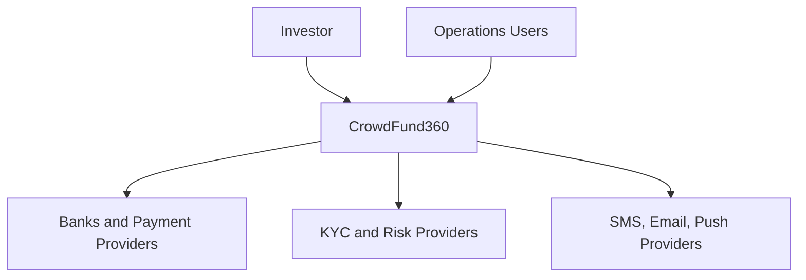

# System Context

CrowdFund360 serves investors, project teams, account managers, compliance officers, administrators, auditors, banks/payment providers, KYC/risk providers, notification providers, and reporting/e-signature partners.

The first implementation baseline exposes a minimal API context endpoint and domain contracts. Future vertical slices should add modules without breaking tenant/project scope, auditability, or financial immutability.

